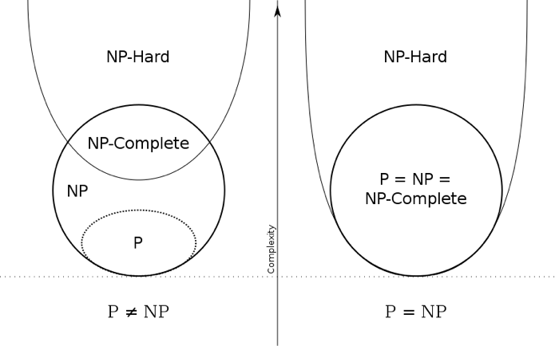

# Problem Categories

## A Quick Summary
There are 4 kinds of problems in algorithm. They are P, NP, NP-complete, and NP-hard.

### What is P?
* An academic answer: **P** is the class of problems which can be solved in polynomial time
on a [deteministic Turing machine](https://en.wikipedia.org/wiki/Turing_machine).
* A simple answer: **P** is the class of problems which can be solved in polynomial time
and every given answer for P can be verified right or wrong in polynomial time.
* For example, sorting $n$ numbers in an array.

### What is NP?
* An academic answer: **NP** is the class of problems which can be solved in polynomial time
on a [non-deteministic Turing machine](https://en.wikipedia.org/wiki/Non-deterministic_Turing_machine).
* A simple answer: **NP** is the class of problems in which we are not sure if polynomial time solution exists 
and every given answer for NP can be verified right or wrong in polynomial time.
* By definition, P is just a subset of NP.
* For example, given a set of numbers, find all subsets which satisfies that the sum of numbers of this subset is zero.

### What is NP-complete?
* A problem $B$ is **NP-complete** if it satisfies two conditions
    1. $B$ is in **NP**.
    2. every $A$ in **NP** is polynomial time reducible to $B$ ("be reducible to" is something like "be converted/encoded to").
* For example, the Boolean satisfiability problem (abbreviated as SAT). SAT is the 1st NP-complete problem found in human history and
this was proved by Stephen Cook and Leonid Levin via their theorem [Cook–Levin theorem](https://en.wikipedia.org/wiki/Cook%E2%80%93Levin_theorem)

### What is NP-hard?
* A problem $B$ is **NP-hard** if it satisfies one condition
    1. every $A$ in **NP** is polynomial time reducible to $B$ ("be reducible to" is something like "be converted/encoded to").
* By definition, NP-complete is just a subset of NP-hard.

## Motivation and History Review of NP-complete
### Why We Need NP-complete?
The answer is that scholar people proposed a concept called "NP-complete"
to help them to prove that $P = NP$.
Let me exlpain as follows. At first, people only categorized problems into
P and NP because these two concepts are very intuitive and practical
to analyze algorithm problems.
Later, schalor people thought that if we can prove $P = NP$,
then it means all NP problems are actually P problems and
we could always find fast enough ("fast" here means solving problems in polynomial time)
algorithms for all NP problems (because $P = NP$).
To prove $P = NP$, scholar people thought a strategy with two steps:

* Step 1. Find a way to convert all NP problems into a harder NP problem in polynomial time.
* Step 2. Try to prove that the "harder" problem in step 1 is actually a P problem.

And scholar people called the "harder" NP problem in the step 1 as "NP-complete", this is where NP-complete comes from.
The concept of NP-complete is very powerful. Assume that we finally succeed in the step 2, then it means
that any NP problem can be converted into an NP-complete problem (ex: SAT) in polynomial time and solved in polynomial time.
The definition of NP-complete is mentioned in the section **What is NP-complete?**.
Besides the SAT problem we mentioned above, there are other NP-complete problems like
[Karp's 21 NP-complete problems](https://en.wikipedia.org/wiki/Karp%27s_21_NP-complete_problems).

### Is $P = NP$ proved?
The answer is "No". For the two steps we mentioned in **Why We Need NP-complete?**,
scholar people succeeded in the step 1 but failed in the step 2.
Until today (Jan. 2019), $P = NP$ has not been proved yet and
in fact most people believe that $P \neq NP$. The following figure shows the relations of P, NP, NP-complete, and NP-hard
under different scenarios.

## References
* [https://www.ycc.idv.tw/algorithm-complexity-theory.html](https://www.ycc.idv.tw/algorithm-complexity-theory.html)
* Michael Sipser (2013). *Introduction to the Theory of Computation, Third edition*, **Ch. 7**. Cengage Learning.
